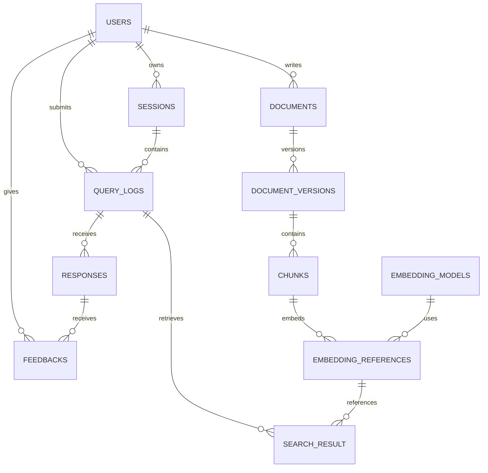

# RAG_RDBMS

RAG(Retrieval-Augmented Generation, 검색 증강 생성) 시스템의 **문서·검색 근거·질의·응답 이력을 관리하기 위한 Oracle 관계형 데이터베이스 설계 프로젝트**입니다.

문서 버전과 청크를 임베딩 참조에 연결하고, 사용자 질의에 사용된 검색 결과와 생성 응답, 피드백을 기록하는 구조를 SQL로 정의합니다. 현재 저장소에는 **11개 테이블의 DDL과 샘플 데이터**가 있으며, 문서 수집·임베딩 생성·벡터 검색·LLM 호출을 수행하는 애플리케이션 코드는 포함되어 있지 않습니다.

## 주요 구성

- **사용자와 대화 이력**: 사용자, 세션, 질의 내용을 연결합니다.
- **응답과 평가**: 응답 모델, 처리 지연, 토큰 사용량, 사용자 평점과 의견을 저장합니다.
- **문서와 버전**: 문서 메타데이터, 변경 이력, 버전별 청크를 관리합니다.
- **임베딩 메타데이터**: 모델 정보, 벡터 ID, 컬렉션 이름, 재임베딩 필요 여부를 기록합니다.
- **검색 근거 추적**: 질의별 검색 순위와 유사도를 저장하고 원문 청크까지 추적합니다.

벡터 값 자체를 저장하는 컬럼은 없습니다. `EMBEDDING_REFERENCES`는 벡터 저장소와 연결하기 위한 참조 정보를 보관하며, 실제 벡터 저장소 연동은 별도로 구현해야 합니다.

## 저장소 구조

```text
RAG_RDBMS/
├── README.md
└── DB/
    └── RAG_DB/
        ├── RAG_ADMIN@XEPDB1.sql       # DDL·DML·삭제문이 혼재한 통합 SQL
        ├── tables/                  # 01~11: 테이블별 정의
        │   ├── 01_USERS.sql
        │   ├── 02_SESSIONS.sql
        │   ├── 03_QUERY_LOGS.sql
        │   ├── 04_RESPONSES.sql
        │   ├── 05_FEEDBACKS.sql
        │   ├── 06_DOCUMENTS.sql
        │   ├── 07_DOCUMENT_VERSIONS.sql
        │   ├── 08_CHUNKS.sql
        │   ├── 09_EMBEDDING_MODELS.sql
        │   ├── 10_EMBEDDING_REFERENCES.sql
        │   └── 11_SEARCH_RESULT.sql
        └── seeds/                   # 테이블별 샘플 INSERT
```

## 데이터 모델

아래 관계도는 `tables/`에 정의된 외래 키를 기준으로 작성했습니다. 모든 자식 행은 해당 부모를 참조하며, 부모에는 자식이 없거나 여러 개 있을 수 있습니다.



| 테이블 | 역할 | 주요 컬럼 |
| --- | --- | --- |
| `USERS` | 사용자 정보와 권한 | `USER_ID`, `NAME`, `ROLE` |
| `SESSIONS` | 사용자별 대화 세션 | `SESSION_ID`, `USER_ID`, `SUMMARY`, `STARTED_AT`, `ENDED_AT` |
| `QUERY_LOGS` | 질의와 검색 설정 기록 | `QUERY_ID`, `SESSION_ID`, `USER_ID`, `QUERY_TEXT`, `PARAMETERS` |
| `RESPONSES` | 생성 응답과 사용량 | `RESPONSE_ID`, `QUERY_ID`, `RESPONSE_MODEL`, `RESPONSE_DELAY`, `PROMPT_TOKEN`, `COMPLETE_TOKEN` |
| `FEEDBACKS` | 응답에 대한 사용자 평가 | `FEEDBACK_ID`, `RESPONSE_ID`, `USER_ID`, `GRADE`, `ERROR_TYPE` |
| `DOCUMENTS` | 문서 메타데이터 | `DOCUMENT_ID`, `DOCUMENT_TITLE`, `WRITER_ID`, `DOCUMENT_STATE` |
| `DOCUMENT_VERSIONS` | 문서 버전과 변경 이력 | `DOCUMENT_VERSION_ID`, `DOCUMENT_ID`, `VERSION_NUM`, `CHANGED_RECORD` |
| `CHUNKS` | 버전별 문서 조각 | `CHUNK_ID`, `DOCUMENT_VERSION_ID`, `CHUNK_TEXT`, `CHUNK_ORDER`, `TOKEN_LENGTH` |
| `EMBEDDING_MODELS` | 임베딩 모델 메타데이터 | `MODEL_ID`, `MODEL_NAME`, `DIMENSION`, `MODEL_VERSION` |
| `EMBEDDING_REFERENCES` | 청크와 벡터 저장소의 연결 정보 | `EMB_REF_ID`, `CHUNK_ID`, `MODEL_ID`, `VECTOR_ID`, `COLLECTION_NAME`, `REEMBED_NEEDED` |
| `SEARCH_RESULT` | 질의별 검색 근거와 점수 | `RESULT_ID`, `QUERY_ID`, `EMB_REF_ID`, `RESULT_RANK`, `SIMILARITY` |

### 데이터 흐름

1. 문서와 버전을 등록하고, 해당 버전의 본문을 청크로 저장합니다.
2. 외부에서 생성한 임베딩의 벡터 ID를 청크 및 모델 정보와 연결합니다.
3. 사용자의 질의를 세션에 기록하고, 검색된 임베딩 참조와 순위·유사도를 저장합니다.
4. 생성된 응답과 토큰 사용량을 기록하고, 응답에 대한 사용자 피드백을 연결합니다.

이는 스키마가 표현하는 흐름입니다. 각 단계의 자동 처리는 현재 구현되어 있지 않습니다. 검색 결과는 응답이 아닌 **질의에 연결**되므로, 한 질의에 여러 응답이 있을 때 응답별로 사용한 근거를 구분하는 구조는 아닙니다.

### 주요 제약조건

- 사용자 권한: `USER`, `ADMIN`
- 문서 상태: `ACTIVE`, `DISABLED`
- 피드백 평점: 1~5
- 검색 순위: 1 이상 / 유사도: 0~1
- 문서 버전 번호: 1 이상
- 재임베딩 표시: `N`, `Y` (`NULL`도 허용)
- 응답 토큰 수: 0 이상 / 응답 지연: `NULL` 또는 0 이상

일부 외래 키에는 `ON DELETE CASCADE`가 정의되어 있습니다. 예를 들어 세션 삭제는 질의와 그에 연결된 응답·피드백·검색 결과 삭제로 이어집니다. 모든 관계에 연쇄 삭제가 적용되는 것은 아니므로, 삭제 동작은 각 테이블 정의를 확인해야 합니다.

## 실행 방법

### 1. 준비

- Oracle Database와 SQL 실행 도구(예: SQL Developer)
- 테이블 생성 권한과 테이블스페이스 할당량이 있는 작업용 스키마
- 한글 샘플 데이터를 읽을 수 있는 문자 인코딩 설정

SQL은 `VARCHAR2`, `NUMBER`, `DATE`, `SYSDATE` 등 Oracle 문법을 사용합니다. 파일명에는 `RAG_ADMIN@XEPDB1`이 등장하지만, 계정 생성 스크립트나 접속 설정은 제공되지 않습니다. 실제 계정·서비스 이름은 본인 환경에 맞게 준비합니다.

```bash
git clone https://github.com/taeho01lab-alt/RAG_RDBMS.git
cd RAG_RDBMS
```

### 2. 테이블 생성

> **현재 SQL 파일 전체를 한 번에 실행하지 마세요.**  
> `tables/02_SESSIONS.sql`에는 샘플 INSERT와 `DROP TABLE SESSIONS;`가 포함되어 있습니다. `RAG_ADMIN@XEPDB1.sql`에는 생성 전 테이블을 참조하는 INSERT, 미완성 INSERT, DROP 문이 섞여 있습니다.

빈 작업용 스키마에서 `tables/` 파일을 **01 → 11 순서로 열고, 각 파일의 `CREATE TABLE ... );` 구문만 선택하여 실행**합니다. 이 순서는 외래 키가 참조하는 테이블을 먼저 생성합니다.

특히 `02_SESSIONS.sql`의 CREATE TABLE 뒤에 있는 INSERT·DROP·SELECT는 이 단계에서 실행하지 않습니다. 샘플 데이터는 다음 단계에서 별도로 넣습니다.

### 3. 샘플 데이터 입력

모든 테이블이 생성된 후, 아래 순서로 `seeds/` 파일의 **INSERT 구문만 선택하여 실행**합니다. 일부 파일 끝의 SELECT에는 세미콜론이 없으므로, 원본 파일 일괄 실행 대신 INSERT 부분을 사용합니다.

| 순서 | 파일 |
| --- | --- |
| 1 | `seed_users.sql` |
| 2 | `seed_sessions.sql` |
| 3 | `seed_query_logs.sql` |
| 4 | `seed_responses.sql` |
| 5 | `seed_feedbacks.sql` |
| 6 | `seed_documents.sql` |
| 7 | `seed_document_versions.sql` |
| 8 | `seed_chunks.sql` |
| 9 | `seed_embedding_models.sql` |
| 10 | `seed_embedding_references.sql` |
| 11 | `seed_search_result.sql` |

입력 결과를 확인한 다음 저장합니다.

```sql
COMMIT;
```

샘플 데이터는 사용자 4개, 나머지 각 테이블 3개 행으로 구성되어 있습니다. 고정 ID를 사용하므로 같은 데이터를 다시 INSERT하면 기본 키 중복 오류가 발생합니다.

## 조회 예제

### 질의에 사용된 검색 근거 추적

검색 결과에서 임베딩 참조, 청크, 문서 버전을 거쳐 원문 문서까지 조회합니다.

```sql
SELECT
    q.QUERY_ID,
    q.QUERY_TEXT,
    sr.RESULT_RANK,
    sr.SIMILARITY,
    d.DOCUMENT_TITLE,
    dv.VERSION_NUM,
    c.CHUNK_TEXT
FROM QUERY_LOGS q
JOIN SEARCH_RESULT sr
    ON sr.QUERY_ID = q.QUERY_ID
JOIN EMBEDDING_REFERENCES er
    ON er.EMB_REF_ID = sr.EMB_REF_ID
JOIN CHUNKS c
    ON c.CHUNK_ID = er.CHUNK_ID
JOIN DOCUMENT_VERSIONS dv
    ON dv.DOCUMENT_VERSION_ID = c.DOCUMENT_VERSION_ID
JOIN DOCUMENTS d
    ON d.DOCUMENT_ID = dv.DOCUMENT_ID
WHERE q.QUERY_ID = 'Q001'
ORDER BY sr.RESULT_RANK;
```

제공된 샘플 기준으로 `Q001`은 `C001`, `C002` 두 청크를 순위 1·2, 유사도 0.92·0.88로 참조합니다.

### 응답과 사용자 평가 확인

```sql
SELECT
    q.QUERY_TEXT,
    r.RESPONSE_TEXT,
    r.RESPONSE_MODEL,
    r.PROMPT_TOKEN,
    r.COMPLETE_TOKEN,
    f.GRADE,
    f.FEEDBACK_COMMENT
FROM QUERY_LOGS q
JOIN RESPONSES r
    ON r.QUERY_ID = q.QUERY_ID
LEFT JOIN FEEDBACKS f
    ON f.RESPONSE_ID = r.RESPONSE_ID
ORDER BY q.QUERY_ID, r.RESPONSE_ID, f.FEEDBACK_ID;
```

## 현재 상태와 개선 과제

현재는 스키마와 샘플 데이터 중심의 프로젝트입니다. 실행 안내는 저장소 SQL을 검토해 작성했으며, 실제 Oracle 인스턴스에서 실행 검증한 결과는 아닙니다.

- **초기화 스크립트 정리**: DDL·샘플 데이터·삭제 작업을 분리하고, 자동 실행 가능한 초기화 스크립트를 마련할 수 있습니다.
- **비밀번호 저장 방식**: 현재 `PASSWORD VARCHAR2(20)`와 평문 샘플 값이 사용됩니다. 실제 인증 기능에는 비밀번호 해시 저장을 위한 스키마와 처리가 필요합니다.
- **숫자형 정합성**: `CHUNKS.TOKEN_LENGTH`는 문자열 타입이지만 숫자 비교 제약조건을 사용합니다. 숫자형으로 정리하는 것이 개선 과제입니다.
- **샘플 데이터 의미 정합성**: `DV002`는 `D001`의 버전이지만 연결된 `C003`에는 Oracle 설명이 들어 있습니다. 외래 키 연결과 별개로 예제 내용의 일관성을 정리할 수 있습니다.
- **추가 무결성 규칙**: 문서 내 버전 번호·버전 내 청크 순서의 중복 방지, 질의 사용자와 세션 소유자의 일치 여부는 현재 제약조건으로 보장되지 않습니다.
- **애플리케이션 연동**: 문서 처리, 임베딩 생성, 벡터 검색, LLM 응답 생성, API·UI는 후속 구현 대상입니다.
